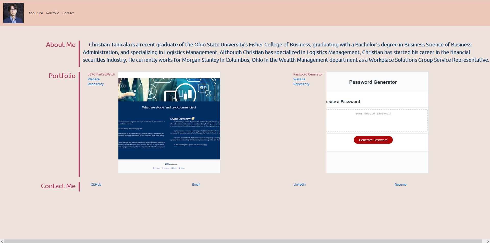

# Portfolio Website

## Description
- The purpose of this project is to create a website for me to consolidate my projects as well as information about me into one place.

## Technologies
- Bootstrap (CSS)
- Javascript
- HTML

## Troubleshooting
- If LinkedIn link does not work, please sign in.

## Screenshot
- 

## Credits
- https://coding-boot-camp.github.io/full-stack/github/professional-readme-guide (ReadMe Guide)
- https://www.w3schools.com/html/html5_semantic_elements.asp (HTML Semantics)
- https://picsum.photos/ (Placeholder Images)

## License
- MIT

## Links
- https://chtanicala.github.io/Website-Portfolio/ (Website Link)
- https://github.com/Chtanicala/Website-Portfolio (Repository)

## Contributors
- Christian Tanicala
    - christian.tanicala@gmail.com