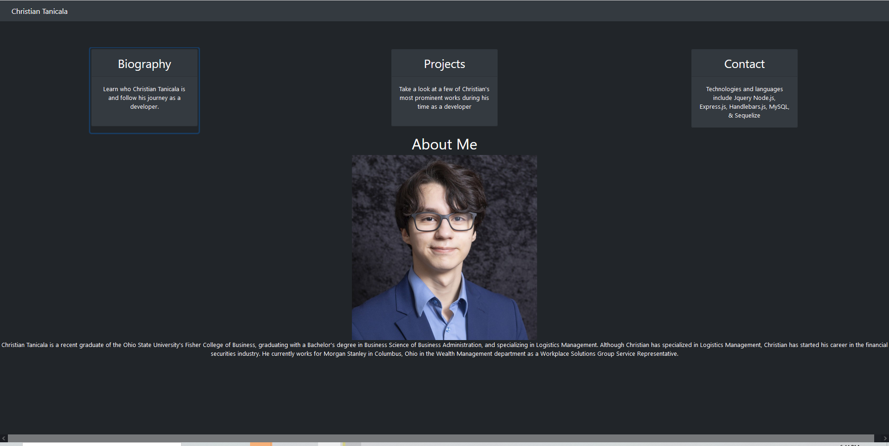

# Portfolio Website

## Description
- The purpose of this project is to create a website for me to consolidate my projects as well as information about me into one place.

## Technologies
- Bootstrap (CSS)
- Javascript
- HTML
- jQuery

## Troubleshooting
- If LinkedIn link does not work, please sign in.

## Screenshot
- 

## Credits

## License
- MIT

## Links
- https://chtanicala.github.io/Website-Portfolio/index.html (Website Link)
- https://github.com/Chtanicala/Website-Portfolio (Repository)

## Contributors
- Christian Tanicala
    - christian.tanicala@gmail.com
